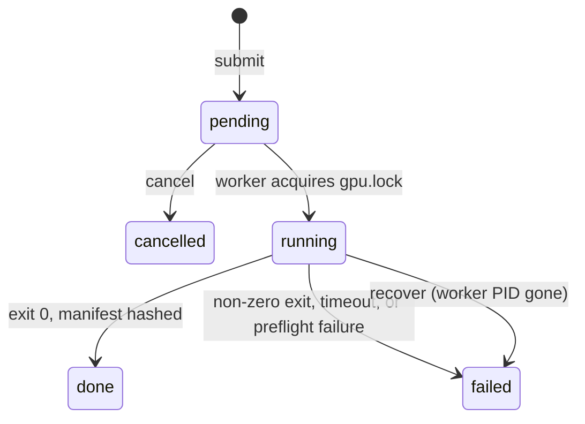
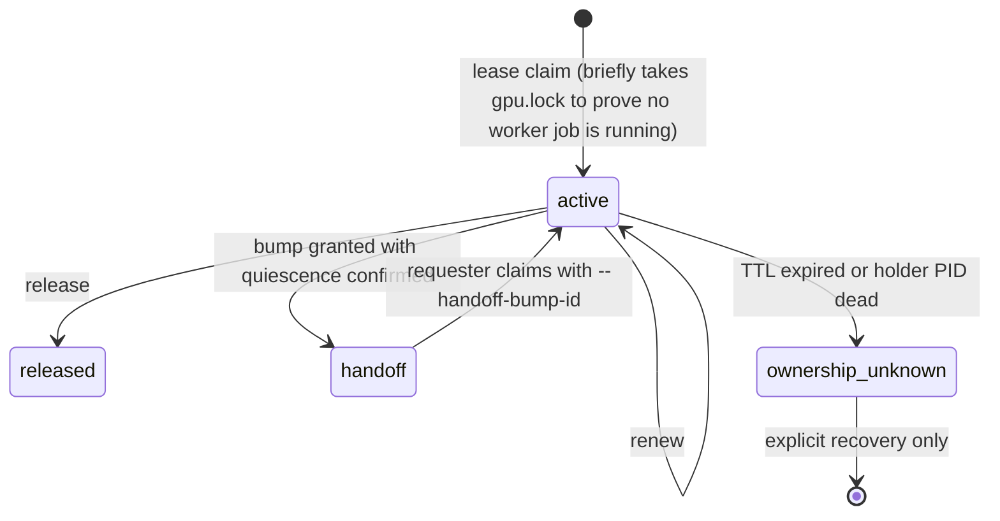

# gpu-greenroom

[](https://github.com/lyonsno/gpu-greenroom/actions/workflows/test.yml)

A filesystem-backed job queue and cooperative lease protocol that lets a
crowd of autonomous agents share one Apple Silicon GPU without stepping on
each other. One job at a time, strict FIFO, crash-safe receipts, and a
handoff protocol for GPU work the queue did not launch. Zero dependencies
beyond the Python standard library.

It has been the scheduler for a single M4 Max running a fleet of coding
agents since June 2026:

| Since 2026-06-10, one machine | |
|---|---|
| Jobs receipted | 5,795 |
| Distinct job types | 335 |
| Cumulative GPU time serialized | 336 hours |
| Longest single job | 13.3 hours |

Snapshot taken 2026-09-23 from the queue directory on the author's machine.
The job types range from image-to-3D generation
([TRELLIS.2](https://github.com/lyonsno/trellis2mlx),
[Pixal3D](https://github.com/lyonsno/pixal3d-mlx),
[SF3D](https://github.com/lyonsno/sf3d-webgpu)) and text-to-image
([FLUX and Ideogram via MLX](https://github.com/lyonsno/mlx-ideogram4)) to
monocular depth ([MoGe](https://github.com/lyonsno/moge-mlx)), MLX training
loops, Blender renders, and headless WebGPU witnesses for
[Kaminos](https://github.com/lyonsno/kaminos).

## The problem

Apple Silicon has one GPU and one pool of unified memory. Two 30 GB
inference jobs at once is not a slowdown, it is a Metal scheduler deadlock,
an out-of-memory kill, or a kernel panic. Meanwhile twenty coding agents,
each in its own terminal, each want the GPU right now, and some of that
work is interactive: a live WebGPU render in Chrome, a resident model
serving a prototype. A batch queue alone cannot see those.

`gpu-greenroom` answers both halves:

- **Batch work** is submitted as a job. A single worker runs jobs one at a
  time under an exclusive `flock`, oldest first.
- **Interactive work** claims a **lease**. While a lease is active, the
  worker stays out. Other agents can send a **bump**, asking the holder for
  a handoff window; the holder answers grant, grant-after-checkpoint, or
  decline, and every answer leaves a receipt.

## Quick start

```bash
git clone https://github.com/lyonsno/gpu-greenroom && cd gpu-greenroom
uv pip install -e .

gpu-greenroom worker &                         # one worker per GPU
gpu-greenroom submit echo /path/to/input.png   # built-in smoke job type
gpu-greenroom list
gpu-greenroom status <job-id>
cat ~/.local/state/gpu-greenroom/done/<job-id>/receipt.json
```

Real job types are declared in `job_types.json` in the queue directory and
hot-reloaded every poll, so adding a generator never restarts the worker:

```json
{
  "sf3d": {
    "cmd": ["/path/to/sf3d/.venv/bin/python", "-u", "run.py",
            "--image", "{input_path}", "--output-dir", "{output_dir}",
            "--dtype", "{dtype}"],
    "cwd": "/path/to/sf3d",
    "env": {"PYTORCH_ENABLE_MPS_FALLBACK": "1"},
    "defaults": {"dtype": "float16"},
    "artifact_manifest": ["*.glb"]
  }
}
```

```bash
gpu-greenroom submit sf3d skull.png -p dtype=float32
```

## Job lifecycle



A job's state is the directory it is in. `pending/`, `running/`, `done/`,
`failed/`, `cancelled/` are the whole database, transitions are `rename(2)`,
and `ls` is the admin console.

## Cooperative leases and bumps



The protocol is cooperative. Greenroom records who owns the GPU and when a
safe handoff window exists. It never preempts, pauses, signals, kills,
times out, or reorders the current holder. An agent that wants the GPU
while a lease is active sends a bump describing its intended route,
workload class, memory pressure, and whether it needs full quiescence, then
waits on a filesystem event, not a polling loop. The holder decides.

## Design decisions

**The filesystem is the database.** No daemon, no socket, no broker, no
SQLite. Every agent on the machine already has the one capability required
to participate: it can read and write files. Debugging a stuck queue is
`ls running/`. Backing it up is `cp -r`.

**One execution mutex.** `gpu.lock` is the only thing that means "the GPU
is in use." A second lock, `coordination.lock`, serializes JSON state
transitions and is explicitly not execution authority; holding it proves
nothing about the GPU. Keeping those separate is what makes lease claims,
cancels, and stale recovery race-free without ever blocking a running job.

**Expiry means unknown, never free.** A lease whose TTL lapses or whose
holder PID disappears without a release receipt transitions to
`ownership_unknown`, and the worker stays blocked. Silence from a process
that was using 40 GB of unified memory is not evidence that the memory is
back. Someone has to say so.

**A grant is a wakeup, not authority.** A granted bump tells the requester a
handoff window exists. The requester still has to claim its own lease,
bound to the bump ID, with its own identity. The holder's lease enters
`handoff` and the worker stays out until the requester either takes over or
the holder releases.

**Receipts record what actually ran.** Every terminal job gets a
`receipt.json` with the effective command line after substitution, the
effective working directory, environment overlay, defaults, timeout, and
any submitted params the template ignored. A job type can additionally ask
for input attestation (hash the input, record its git commit and dirty
state, fail if it changed underneath the run), a runtime identity probe
(run a command before the job and record which interpreter and device it
saw), and an artifact manifest (hash every output that matched a glob, fail
if none did). A subprocess that launched is not evidence of anything until
the receipt proves the route.

**Estimates are diagnostic only.** A bump's estimated occupancy is recorded
with the field `estimated_occupancy_authority: "diagnostic_only"` next to
it. Nothing schedules on it, and nothing can be made to.

**Failures name their phase.** `dispatch`, `source_preflight`,
`runtime_identity`, `launch`, `execution`, `timeout`, `source_postflight`,
`metadata`, `artifact_manifest`, `stale_recovery`. "It failed" is never the
whole receipt.

**Substitution is single-pass and injection-safe.** Templates are lists,
not shell strings. A param value containing `{input_path}` stays literal.
Params the template did not consume are reported, not dropped.

## What it is not

It is not a cluster scheduler, and it does not enforce anything on
processes that ignore it. A lease only works if the process that should
claim one does. It does not measure GPU memory; it trusts the numbers a
bump declares and labels them as such. It serializes to one GPU per queue
directory; the multi-queue registry and browser console for operating
several collision domains from one page are on a branch and land after the
core here.

## Reference

The full CLI (including every lease and bump flag), the on-disk layout, job
type configuration fields, the receipt schema, failure phases, and the
route-review checklist are in [`docs/reference.md`](docs/reference.md).
Empirical guidance on preparing source images and comparing image-to-3D
routes lives in the
[generator field guide](docs/generator-field-guide.md).

## Tests

```bash
uv run --extra test python -m pytest tests/ -q
```

112 tests: flock serialization, FIFO order, cancel and recovery races,
param injection, receipt route identity, attestation and manifest failure
phases, pause/resume, durable versus volatile output paths, lease claim
and expiry, dead and live PID handling, duplicate and concurrent bumps,
release/grant races, handoff identity binding, and wait wakeup races.

## License

MIT.
