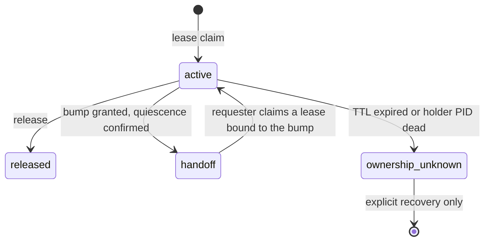

# gpu-greenroom

[](https://github.com/lyonsno/gpu-greenroom/actions/workflows/test.yml)

A filesystem-backed job queue and cooperative lease protocol that lets a
crowd of autonomous agents share one Apple Silicon GPU without stepping on
each other. One job at a time, strict FIFO, crash-safe receipts, and a
handoff protocol for GPU work the queue did not launch. Zero dependencies
beyond the Python standard library.

It has been the scheduler for a single M4 Max running a fleet of coding
agents since June 2026:

| Since 2026-06-10, one machine | |
|---|---|
| Jobs receipted | 5,795 |
| Distinct job types | 335 |
| Cumulative GPU time serialized | 336 hours |
| Longest single job | 13.3 hours |

Snapshot taken 2026-09-23 from the queue directory on the author's machine.
The job types range from image-to-3D generation
([TRELLIS.2](https://github.com/lyonsno/trellis2mlx),
[Pixal3D](https://github.com/lyonsno/pixal3d-mlx),
[SF3D](https://github.com/lyonsno/sf3d-webgpu)) and text-to-image
([FLUX and Ideogram via MLX](https://github.com/lyonsno/mlx-ideogram4)) to
monocular depth ([MoGe](https://github.com/lyonsno/moge-mlx)), MLX training
loops, Blender renders, and headless WebGPU witnesses for
[Kaminos](https://github.com/lyonsno/kaminos).

## The problem

Apple Silicon has one GPU and one pool of unified memory. Two 30 GB
inference jobs at once is not a slowdown, it is a Metal scheduler deadlock,
an out-of-memory kill, or a kernel panic. Meanwhile twenty coding agents,
each in its own terminal, each want the GPU right now, and some of that
work is interactive: a live WebGPU render in Chrome, a resident model
serving a prototype. A batch queue alone cannot see those.

`gpu-greenroom` answers both halves:

- **Batch work** is submitted as a job. A single worker runs jobs one at a
  time under an exclusive `flock`, oldest first.
- **Interactive work** claims a **lease**. While a lease is active, the
  worker stays out. Other agents can send a **bump**, asking the holder for
  a handoff window; the holder answers grant, grant-after-checkpoint, or
  decline, and every answer leaves a receipt.

## Quick start

```bash
git clone https://github.com/lyonsno/gpu-greenroom && cd gpu-greenroom
uv pip install -e .

gpu-greenroom worker &                         # one worker per GPU
gpu-greenroom submit echo /path/to/input.png   # built-in smoke job type
gpu-greenroom list
gpu-greenroom status <job-id>
cat ~/.local/state/gpu-greenroom/done/<job-id>/receipt.json
```

Real job types are declared in `job_types.json` in the queue directory and
hot-reloaded every poll, so adding a generator never restarts the worker:

```json
{
  "sf3d": {
    "cmd": ["/path/to/sf3d/.venv/bin/python", "-u", "run.py",
            "--image", "{input_path}", "--output-dir", "{output_dir}",
            "--dtype", "{dtype}"],
    "cwd": "/path/to/sf3d",
    "env": {"PYTORCH_ENABLE_MPS_FALLBACK": "1"},
    "defaults": {"dtype": "float16"},
    "artifact_manifest": ["*.glb"]
  }
}
```

```bash
gpu-greenroom submit sf3d skull.png -p dtype=float32
```

## Exact commands, a console, and more than one queue

An agent that already knows exactly what to run can skip the job type
registry and submit an exact argv with its own working directory,
environment overlay, owner, and route label:

```bash
gpu-greenroom submit-command \
  --agent-id example-agent \
  --repo-root /path/to/repo --cwd /path/to/repo \
  --route-identity "assays/grid32-bounded" \
  --env BACKEND=mlx \
  --output-dir /durable/results/grid32 \
  -- /path/to/repo/.venv/bin/python -u scripts/grid32.py
```

The argv runs with `shell=False` and no substitution. The receipt records
the exact argv, the worker's own source checkout and commit, and the
capabilities the worker claimed the job with. A worker too old to honor a
capability the request needs leaves that job at the head of the queue
untouched instead of skipping past it.

`gpu-greenroom operator` serves a token-authenticated, loopback-only web
console: queue state, each job's owner and route, queue wait versus
execution time, pause and resume with owner and epoch receipts, and cancel
or stop for the job in front of you. `gpu-greenroom doctor --json` checks
executable discovery, imports, queue writes, and dispatch availability.
`gpu-greenroom queues register|status|pause|resume` groups several queue
directories into one contention class so a single pause holds every
worker on an accelerator at its execution-start boundary, with an epoch so
a stale controller cannot resume a newer pause.

## Job lifecycle

```mermaid
stateDiagram-v2
    [*] --> pending: submit
    pending --> cancelled: cancel
    pending --> running: worker acquires gpu.lock
    running --> done: exit 0, outputs hashed
    running --> failed: non-zero exit, timeout, preflight failure, worker shutdown, or worker died
    running --> running: process group would not quiesce; receipt says ownership_unknown
```



A job's state is the directory it is in. `pending/`, `running/`, `done/`,
`failed/`, `cancelled/` are the whole database, transitions are `rename(2)`,
and `ls` is the admin console. The one deliberate exception: a job whose
process group cannot be confirmed dead after the leader exits, times out,
or is stopped stays in `running/` with a receipt whose status is
`ownership_unknown`. Nothing moves it until an operator recovers it, for the
same reason a lease never expires into "free".

## Cooperative leases and bumps



A claim briefly takes `gpu.lock` to prove no worker job is running, then
holds the GPU by renewing within its TTL. The protocol is cooperative.
Greenroom records who owns the GPU and when a safe handoff window exists. It never preempts, pauses, signals, kills,
times out, or reorders the current holder. An agent that wants the GPU
while a lease is active sends a bump describing its intended route,
workload class, memory pressure, and whether it needs full quiescence, then
waits on a filesystem event, not a polling loop. The holder decides.

## Design decisions

**The filesystem is the database.** No daemon, no socket, no broker, no
SQLite. Every agent on the machine already has the one capability required
to participate: it can read and write files. Debugging a stuck queue is
`ls running/`. Backing it up is `cp -r`.

**One execution mutex.** `gpu.lock` is the only thing that means "the GPU
is in use." A second lock, `coordination.lock`, serializes JSON state
transitions and is explicitly not execution authority; holding it proves
nothing about the GPU. Keeping those separate is what makes lease claims,
cancels, and stale recovery race-free without ever blocking a running job.

**Expiry means unknown, never free.** A lease whose TTL lapses or whose
holder PID disappears without a release receipt transitions to
`ownership_unknown`, and the worker stays blocked. Silence from a process
that was using 40 GB of unified memory is not evidence that the memory is
back. Someone has to say so.

**A grant is a wakeup, not authority.** A granted bump tells the requester a
handoff window exists. The requester still has to claim its own lease,
bound to the bump ID, with its own identity. The holder's lease enters
`handoff` and the worker stays out until the requester either takes over or
the holder releases.

**Receipts record what actually ran.** Every job that started, and every
job stopped by a timeout, a shutdown, or an operator, gets a
`receipt.json` with the exact argv after substitution, the effective
working directory, environment overlay, defaults, timeout, the worker's own
PID, source checkout and capabilities, the child PID, process group, and
process start identity, and any submitted params the template ignored.
The one job that gets no receipt is an unknown job type, which fails at
`dispatch` with a status record only. A job type declared in
`job_types.json` can additionally ask for input attestation (hash the input, record its git commit and dirty
state, fail if it changed underneath the run), a runtime identity probe
(run a command before the job and record which interpreter and device it
saw), and an artifact manifest (hash every output that matched a glob, fail
if none did). Structured command jobs carry an exact argv and none of
those three. A subprocess that launched is not evidence of anything until
the receipt proves the route.

**Estimates are diagnostic only.** A bump's estimated occupancy is recorded
with the field `estimated_occupancy_authority: "diagnostic_only"` next to
it. Nothing schedules on it, and nothing can be made to.

**Failures name their phase.** `dispatch`, `source_preflight`,
`runtime_identity`, `launch`, `execution`, `timeout`, `worker_shutdown`,
`source_postflight`, `metadata`, `artifact_manifest`, `stale_recovery`, and
four `*_quiescence_unresolved` phases for the cases where the process group
could not be confirmed dead. "It failed" is never the whole receipt.

**Substitution is single-pass and injection-safe.** Templates are lists,
not shell strings. A param value containing `{input_path}` stays literal.
Params the template did not consume are reported, not dropped.

## What it is not

It is not a cluster scheduler, and it does not enforce anything on
processes that ignore it. A lease only works if the process that should
claim one does. It does not measure GPU memory; it trusts the numbers a
bump declares and labels them as such. Each queue directory has its own
worker and its own lock; the registry groups directories for aggregate
pause but does not merge them.

## Reference

The full CLI (including every lease and bump flag), the on-disk layout, job
type configuration fields, the receipt schema, failure phases, and the
route-review checklist are in [`docs/reference.md`](docs/reference.md).
Empirical guidance on preparing source images and comparing image-to-3D
routes lives in the
[generator field guide](docs/generator-field-guide.md).

## Tests

```bash
uv run --extra test python -m pytest tests/ -q
```

174 tests: flock serialization, FIFO order, cancel and recovery races,
param injection, receipt route identity, attestation and manifest failure
phases, structured command admission and capability-aware claiming,
pause/resume with epochs, aggregate queue control, the operator console,
durable versus volatile output paths, lease claim and expiry, dead and
live PID handling, duplicate and concurrent bumps, release/grant races,
handoff identity binding, and wait wakeup races.

## License

MIT.
